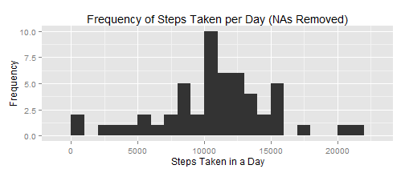
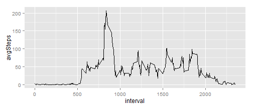
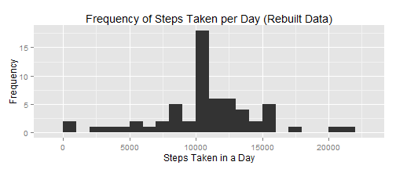

\  

**1. Load in necessary packages**

```r
library(dplyr)
library(ggplot2)
library(lubridate)
```
\  

**2. Loading and preprocessing the data**

```r
#read in data from working directory
raw_data <- read.csv("activity.csv")

#remove NAs from dataset
clean_data <- raw_data[!(is.na(raw_data$steps)),]
```
\  


**3. What is the mean total number of steps taken per day?** 
\  

This step creates a histogram of the number of steps taken per day

```r
#calculate the total number of steps taken per day
grp_data <- group_by(clean_data, date)
daysteps <- summarize(grp_data, sum(steps))
names(daysteps) <- c("date", "steps")

#create a histogram of the total number of steps taken each day
qplot(daysteps$steps, binwidth = 1000, xlab = "Steps Taken in a Day",
      ylab = "Frequency", main = "Frequency of Steps Taken per Day (NAs Removed)")
```

 
\  

This step calculates the mean and median of the total number of steps taken per day

```r
options(scipen = 999)
step_mean <- round(mean(daysteps$steps), 2)
step_med <- median(daysteps$steps)
```
\  

*The mean number of steps taken per day was **10766.19**.*  
*The median number of steps taken per day was **10765**.*  
\  


**4. What is the average daily activity pattern?**
\  

This step creates a plot of the average number of steps taken during a time interval across all days

```r
#calculate the average number of steps taken per interval
time_data <- group_by(clean_data, interval)
timesteps <- summarize(time_data, mean(steps))
names(timesteps) <- c("interval", "avgSteps")

#creates the time series plot of interval vs avgSteps
qplot(interval, avgSteps, data = timesteps, geom = "line")
```

 
\  

This step calculates the interval, on average across all the days in the dataset, that contains the maximum number of steps

```r
maxsteps <- max(timesteps$avgSteps)
maxsteps_time <- timesteps[timesteps$avgSteps == maxsteps,1]
```
\  

*The 5-minute interval, on average across all the days in the dataset, that contains the maximum number of steps is **835** with **206.17 steps**.*  
\  


**5. Inputing missing values**
\  

This step calculates the total number of missing values in the dataset

```r
na_table <- filter(raw_data, is.na(steps))
na_count <- nrow(na_table)
```
\  

*There are **2304** missing values in the dataset.*  
\  

This step fills in the missing data in the dataset with the mean for that time interval to create a rebuilt dataset.

```r
nanew_table <- merge(na_table, timesteps, by.x = "interval", by.y = "interval")
nanew_table <- select(nanew_table, avgSteps, date, interval)
names(nanew_table) <- c("steps", "date", "interval")
rebuilt_data <- rbind(nanew_table, clean_data)
```
\  

This step creates a histogram of the number of steps taken each day using the rebuilt dataset.

```r
#calculate the total number of steps taken per day (rebuilt data)
regrp_data <- group_by(rebuilt_data, date)
redaysteps <- summarize(regrp_data, sum(steps))
names(redaysteps) <- c("date", "steps")

#create a histogram of the total number of steps taken per day (rebuilt data)
qplot(redaysteps$steps, binwidth = 1000, xlab = "Steps Taken in a Day",
      ylab = "Frequency", main = "Frequency of Steps Taken per Day (Rebuilt Data)")
```

 
\  

This step calculates the mean and median of the total number of steps taken per day using the rebuilt dataset.


```r
options(scipen = 999)
restep_mean <- round(mean(redaysteps$steps), 2)
restep_med <- round(median(redaysteps$steps), 2)
```
\  

*The mean number of steps taken per day using the rebuilt data was **10766.19**.*
*The median number of steps taken per day using the rebuilt data was **10766.19**.*
\  

*The histogram and median differ from the estimates in the first part of the assignment (using the clean data).  The mean stayed the same.  Inputing estimates for the missing data caused the histogram frequencies to move toward the median and the median to shift up slightly to equal the mean.*  
\  


**6. Are there differences in activity patterns between weekdays and weekends?**  
\  

This step adds a new factor variable to the rebuilt dataset that indicates whether the record was during a weekday or weekend and then creates a plot of the average number of steps taken during a time interval across all days

```r
#creates new variable for weekend/weekday measurement
rebuilt_data$date <- ymd(rebuilt_data$date)
rebuilt_data <- mutate(rebuilt_data, weekday = weekdays(date), 
                       isWeekend = ifelse((weekday == "Saturday" | weekday == "Sunday"),
                       "weekend", "weekday"))

#calculate the average number of steps taken per interval
retime_data <- group_by(rebuilt_data, interval, isWeekend)
retimesteps <- summarize(retime_data, mean(steps), unique = n_distinct(isWeekend))
names(retimesteps) <- c("interval", "isWeekend", "steps", "unique")
head(retimesteps)
```

```
## Source: local data frame [6 x 4]
## Groups: interval
## 
##   interval isWeekend      steps unique
## 1        0   weekday 2.25115304      1
## 2        0   weekend 0.21462264      1
## 3        5   weekday 0.44528302      1
## 4        5   weekend 0.04245283      1
## 5       10   weekday 0.17316562      1
## 6       10   weekend 0.01650943      1
```

```r
#creates the time series plot of interval vs avgStep
qplot(interval, steps, data = retimesteps, geom = "line", facets = isWeekend ~ .)
```

 
